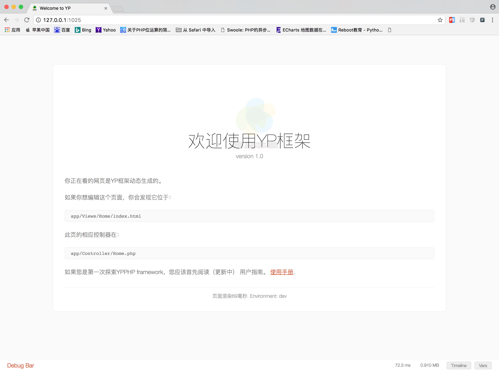

# 安装YP
`YP`的环境要求如下:

+ PHP>=7.1
+ Composer
+ PDO Extension
+ Redis Extension
+ Mbstring Extension
+ CURL Extension

在这里也顺道把**Composer**这个包管理工具的安装说下,如果本地已安装Composer的可以绕道啊,不要浪费宝贵的时间。这里重点讲下Composer,
是因为接下来我们需要用它来管理组件。
废话少说,直接切入主题,安装分一下几个步骤。

> linux下进行全局安装

```
    curl -sS https://getcomposer.org/installer | php
    mv composer.phar /usr/local/bin/composer

```
> **注意:** 如果上诉命令因为权限执行失败， 请使用 **sudo** 再次尝试运行`mv` 那行命令。
现在只需要进入到你的项目的目录执行下面命令初始化Composer

> Composer 初始化

```
composer init
```
你可以根据实际情况输入相关信息。初始化后,在你的项目中会出现一个composer.json的文件,这里包含了composer初始化的相关信息


> Composer 更新

```
composer update

```
这命令将更新你需要的组件


> Mac OSX 系统下全局安装

在mac下,使用`brew`指令安装,别跟我说你不知道`brew`啊,不知道的话,自己Google.以下为安装Composer命令

```
brew install composer
```
> Windows下全局安装

这是安装Composer到你本地的最简单方法。
下载并且运行 [Composer-Setup.exe](https://getcomposer.org/Composer-Setup.exe)，它将安装最新版本的 Composer ，并设置好系统的环境变量，因此你可以在任何目录下直接使用 composer 命令。

可以点击[这里](http://docs.phpcomposer.com/01-basic-usage.html)了解它的基本用法。

至此,Composer安装讲到这,基本使用没问题啊。


> **YP框架的安装**

严格来说,**YP**无需安装过程,这里所说的安装其实就是把**YP**框架放入WEB运行环境（*前提是你的WEB运行环境已经OK*），
目前只支持Git一种方式获取和安装YP

你可以去[这里](https://github.com/ly2513/YPPHP)下载,在此就不再赘述git的安装了。

执行下面命令将框架下载到本地

```git
git clone https://github.com/ly2513/YPPHP.git

```

下载完后进入到`public`目录,以cli模式运行改该框架,下面就是该命令

```php
php -S 127.0.0.1:1025

```
输入该命令后回车键,然后在浏览器的地址栏中输入`127.0.0.1:1025`,你将会在浏览器中看到如下界面



